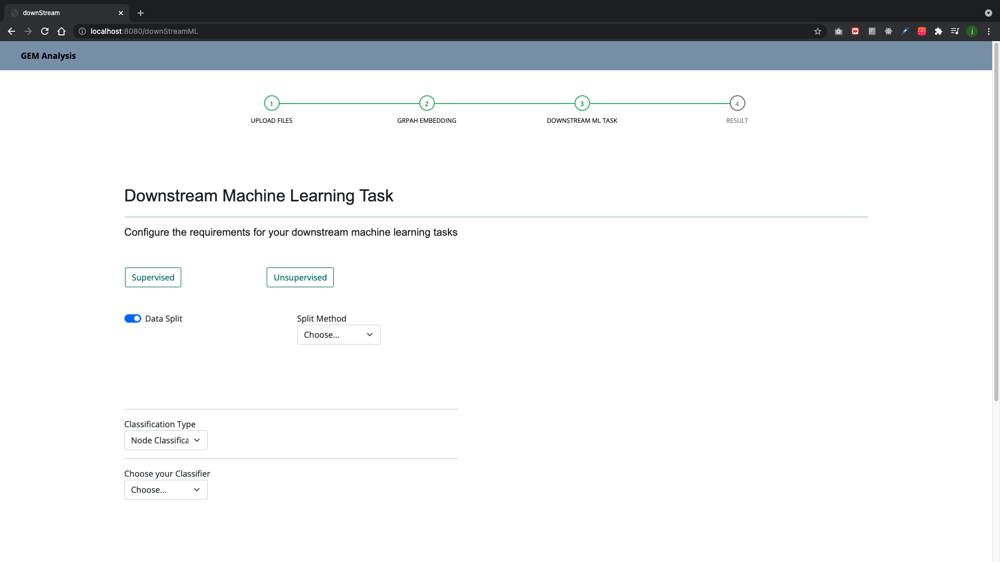

# GEM_Web-Interface
This repo contains a Node.js - Python implementation of Graph Embedding Methods(GEM) that allows users to experiment GEM algorithms and downstream ML tasks in a Web environment.

## Table of contents
* [What is Graph Embedding Methods (GEM)?](#What-is-Graph-Embedding-Methods-(GEM)?)
* [Setup](#Setup)
* [Usage](#usage)
* [Future Work](#future-work)
## What is Graph Embedding Methods (GEM)?
### Introduction
Everything that consists of nodes and edges in relationship can be considered as a graph, such as network data, DNA, brain networks, etc. Since we can store various non-linear information in graphs, there have been research to apply machine learning algorithms on graphs.
However, it has been very challenging to achieve high-performance from machine learning on graphs due to the scalability issues.

### Representation Learning

Recently, <em>Representation Learning</em>, a way to map the nodes of graphs or entire graph onto the low-dimensional vector space, has been suggested to solve thie issues. We then optimized embedded vectors in the low-dimensional space and use them as input features for downstream machine learning tasks such as node classification, link prediction, etc.

### Graph Embedding Methods

The GEM is about approaches to transform the graph data into vectors in latent space, preserving the topological information from the original graph.

<em> Representation Learning: [Original image](https://arxiv.org/pdf/1909.00958v1.pdf)</em>

## Setup
1. `git clone https://github.com/JunyongLee1217/GEM_Web-Interface`
2. Make sure you have recent version of node and Python3
3. `pip3 install -r requirements.txt`
4. `npm init`
5. `npm install`
6. `npm start`

## Usage

### Landing Page
The landing page manages the file uploads. It take three files as input.
* Adjacecny List.dict
  
Dictionary file containing information about connected nodes
* Node Features.csr
  
 Feature vector matrix in csr(Compressed Sparse Matrix)
* Labels.npy

---

### UploadResult
The upload page presents the result of brief analysis of input files, such as the number of classes, the number of data that each label has, etc.
You can binarize(1 and 0) your data labels if input data has multiple classes. If this the case, the positive labels should be populated in comma separated format.

---

### Graph Embedding

You can choose the preferred graph embedding methods that you need. 

* [Laplacian Eigenmaps](https://proceedings.neurips.cc/paper/2001/file/f106b7f99d2cb30c3db1c3cc0fde9ccb-Paper.pdf)
* [Graph Attention Networks(GAT)](https://arxiv.org/pdf/1710.10903.pdf) 
(re-implentation of [this](https://github.com/gordicaleksa/pytorch-GAT) repository.
* Locally Linear Embeeding(LLE)
* Graph Factorization
* HOPE
* SDNE
* node2vec

So far, Laplacian Eigenmaps and GAT have been integrated. For GAT, it currently provides direct classification. The 'only for embedding' option is under development. The

--------------------------------

### Downstrem ML

The downstrem ML page provides machine learning algorithm options that we may apply to the embedded vectors from the graph embedding page.

>Supervised Learning
* Logistic Regression
* SVM
* KNN
* Decision Tree
* Split Method 
  - Hodlout
  - K-fold Validation
  - Random Sampling (Taking Average of num of trials)
* Metric
  - Accuracy
  - Precision
  - Recall
  - F1 Score
  - ROCAUC curve (only for binarized dataset)
> Unsupervised learning
* K-Means
* DBSCAN
* Agglomerative
* Metric
  - Rand Index
  - Normalized Mutual Information(NMI)
  - Silhouette Coefficient

### Result Page
The result page shows the results from the metrics chosen in the downstrem ML step including ROCAUC curve. 

### Result from GAT
In the case of GAT with direct classification, the result page skips downstream ML step and direclty yields result from each epoch and final accuaracy score.

 

## Future Work
* Integrating more Graph Embedding algorithms
* GAT's 'only embedding' option
* Interface for taking multiple downsteam ML algorithms on embedded vectors
  